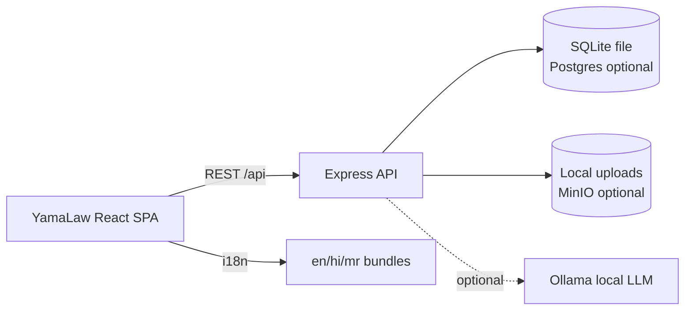

# YamaLaw

<p align="center">
  
</p>

### Citizen Legal Access & Case Continuity Platform

> "YamaLaw is a citizen-centric legal access and case-continuity platform that helps people understand their legal problem, determine their next step, prepare documentation, preserve evidence, access legal aid, connect with legal professionals, perform source-grounded legal research, and track their matter from intake to resolution."

AI is one component. **The workflow is the product.** YamaLaw is workflow-first, not chatbot-first.

Technically derived from the open-source [nyay-setu-working](https://github.com/viru0909-dev/nyay-setu-working) project (MIT) — see attribution below. All product-facing branding is **YamaLaw**.

---

## 1. Product overview

A citizen may know they have a legal problem but not whether it is actionable, which authority applies, which documents/evidence matter, whether legal aid applies, or what the next step is. YamaLaw guides the whole journey:

```
PROBLEM → INTAKE → CLASSIFICATION → JOURNEY → DOCUMENTS → EVIDENCE
→ READINESS → LEGAL AID → LAWYER/AUTHORITY → CASE → TRACKING → RESOLUTION
```

## 2. Problem statement

- Legal awareness is low; procedure is opaque.
- Documents/evidence get lost before advice is sought.
- Legal-aid discovery is fragmented.
- Case continuity breaks between citizen, lawyer, court and police.
- Most tools are either chatbots or single-role dashboards — not a continuity platform.

## 3. Major features

| Area | What YamaLaw does |
|---|---|
| Legal Journey Engine | Keyword classification → reusable journey templates (12 categories) → persisted stages/tasks/requirements |
| Case Readiness | Transparent weighted score (docs 30 / evidence 25 / info 15 / prerequisites 15 / jurisdiction 10 / procedural 5, configurable) |
| Evidence chain of custody | SHA-256 on upload, verify (re-hash & compare), access/download history, tamper flag |
| Legal Aid Discovery | Configurable rules + providers + applications; demo rules clearly labelled |
| Legal Research | Local library search with relevance + matched terms, bookmarks, notes, attach-to-case; "Source not found" instead of hallucination |
| Document intelligence | MIME/extension validation, size limits, hash, local-first (no external transmission) |
| Tasks & deadlines | Overdue / due-today / upcoming / completed |
| Timeline | Every event persisted as audit event |
| Notifications | Internal inbox for assignments, uploads, hearings |
| Hearings | Schedule + virtual-room demo stub |
| FIR intake | Police/authority workflow linked to cases |
| Multilingual UI | English / हिन्दी / मराठी via react-i18next; legal terms kept separate from UI strings |
| RBAC | CITIZEN/LAWYER/JUDGE/POLICE/ADMIN enforced in backend + frontend; object-level case ownership |

## 4. Architecture



- Modular monolith backend (`backend/src/{routes,services,middleware}`).
- No microservices, no event bus, no blockchain — hashed audit trail instead.
- AI is an optional assistive layer (`services/llm.js`); everything works with `AI_ENABLED=false`.

## 5. Technology stack

Backend: Node 22, Express, node:sqlite, JWT, bcryptjs, multer, helmet, express-rate-limit.
Frontend: React 18, Vite, react-router-dom, i18next.
Infra: Docker Compose (`yamalaw-backend`, `yamalaw-frontend`, optional `yamalaw-db`, `yamalaw-minio`, `yamalaw-ollama`).
Free-first replacements: Groq/Gemini → Ollama (optional); paid storage → local/MinIO; paid vectors → local search; SMTP → internal inbox.

## 6. Repository structure

```
yamalaw/
  backend/  src/{index,config,db,seed,routes/{auth,cases,files,misc},services/{journey,readiness,legalaid,llm,notify,docintel},middleware/*}  tests/
  frontend/ src/{App,main,api,i18n/{en,hi,mr},components/*,pages/*}  Dockerfile  nginx.conf
  docker-compose.yml  .env.example  README.md  LICENSE
```

## 7. Prerequisites

Node 22+, npm, Docker (optional but recommended).

## 8. Installation (local)

```powershell
# backend
cd backend; npm install; node src/seed.js --force; node src/index.js
# frontend (second terminal)
cd frontend; npm install; npm run dev
```

Open http://localhost:5173 (API at http://localhost:8080).

## 9. Environment variables

See `.env.example`. Key switches:

```
APP_NAME=YamaLaw  DEMO_MODE=true  AI_ENABLED=false
OLLAMA_ENABLED=false  OLLAMA_BASE_URL=http://localhost:11434  OLLAMA_MODEL=qwen2.5:7b
MINIO_ENABLED=false  EMAIL_ENABLED=false  TRANSLATION_ENABLED=true  WEBRTC_ENABLED=true
RW_DOCUMENTS=30 RW_EVIDENCE=25 RW_INFORMATION=15 RW_PREREQUISITES=15 RW_JURISDICTION=10 RW_PROCEDURAL=5
```

## 10. Docker setup

```powershell
docker compose up --build            # backend + frontend (SQLite, no paid services)
docker compose --profile ollama up   # + local AI
docker compose --profile minio up    # + MinIO
```

## 11. Database migration

Schema is created idempotently in `backend/src/db.js` (`CREATE TABLE IF NOT EXISTS` + indexes + FKs). No destructive migrations; seed is additive (`--force` only for a clean demo reset).

## 12. Demo credentials (password for all: `YamaLaw123`)

| Role | Email |
|---|---|
| Citizen | meera.citizen@yamalaw.demo |
| Citizen | rahul.citizen@yamalaw.demo |
| Lawyer | arjun.lawyer@yamalaw.demo |
| Judge | kavitha.judge@yamalaw.demo |
| Police | vikram.police@yamalaw.demo |
| Admin | admin@yamalaw.demo |

Seeded: tenancy case (YL-2026-1042, full journey), salary case, cyber case + FIR, hearings, tasks, research library.

## 13. Demo workflows (for judging, ~10 min)

1. **Tenancy**: login as Meera → Dashboard → open "Security deposit recovery" → Journey tab shows stages; Readiness ~% with missing payment proof; upload a file as `payment_proof` → readiness rises; Legal Aid → check eligibility; Messages → talk to lawyer.
2. **Employment**: login as Rahul → Issues → new issue "salary not paid" → auto-classified employment → open case → research "salary" → attach result to case.
3. **Cyber**: login as Fatima → case "UPI task-scam" → FIR visible; login as Vikram (police) → FIRs → file/view.
4. **Lawyer research**: login as Arjun → case → Research → bookmark → attach → note.
5. **Evidence verification**: lawyer opens evidence `EV-…` → Verify → VERIFIED + hash shown; access history lists views.

## 14. AI setup using Ollama

```powershell
ollama pull qwen2.5:7b; ollama serve
# .env: AI_ENABLED=true, OLLAMA_ENABLED=true
```

With AI off, rule-based classification, templates, readiness and search all still work.

## 15. Optional external services

None required. MinIO, Postgres, Ollama are opt-in profiles. Email is stubbed to internal notifications.

## 16. Security considerations

JWT (7d), bcrypt-10, helmet, CORS, rate limits on `/api/auth` + `/api`, MIME/extension allowlist, size caps, filename sanitization, object-level case guards, generic 500s (no stack traces), no secrets logged. See `backend/src/middleware/*`.

## 17. Limitations

- SQLite is the default; Postgres needs a `pg` adapter (schema is compatible, adapter not bundled to stay dependency-light).
- OCR/text extraction is metadata-level; full Tesseract/PyMuPDF pipeline is a documented next step.
- WebRTC room is a labelled demo stub retaining the workflow.
- Legal-aid rules and research library are demo data (clearly labelled) awaiting authoritative NALSA/statute feeds.
- Machine translation of statutes is intentionally not offered; UI strings only.

## 18. Future roadmap

uls; e-filing refs; SMS via government gateway (opt-in); OpenSearch when corpus grows; Playwright e2e; PWA offline cache for journey templates.

## Attribution

Product identity is YamaLaw. The implementation was informed by the MIT-licensed https://github.com/viru0909-dev/nyay-setu-working (evidence-vault hashing, FIR, virtual-court, RBAC concepts). Original LICENSE obligations preserved in `LICENSE`.
